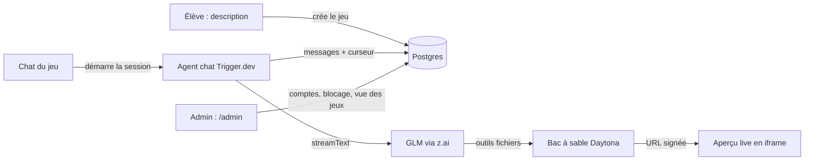

<div align="center">

<br />
<br />

<h1>Sandbox — édition collège</h1>

<p><strong>Décrivez un jeu. Regardez-le se construire. Jouez-y dans le navigateur.</strong></p>

<p>Un atelier de création de jeux 3D par IA, pour une classe : chaque élève décrit un jeu, un agent écrit le code dans son propre bac à sable cloud, et le jeu tourne en direct à côté du chat.</p>

<p>
  <a href="https://ai-sdk.dev/">AI SDK</a>&nbsp;&nbsp;•&nbsp;&nbsp;
  <a href="https://cwa.run/trigger">Trigger.dev</a>&nbsp;&nbsp;•&nbsp;&nbsp;
  <a href="https://cwa.run/daytona">Daytona</a>&nbsp;&nbsp;•&nbsp;&nbsp;
  <a href="https://z.ai">z.ai (GLM)</a>&nbsp;&nbsp;•&nbsp;&nbsp;
  <a href="https://better-auth.com/">Better Auth</a>&nbsp;&nbsp;•&nbsp;&nbsp;
  PostgreSQL&nbsp;+&nbsp;Drizzle&nbsp;&nbsp;•&nbsp;&nbsp;
  <a href="https://dokploy.com">Dokploy</a>
</p>

</div>

<br />

> Cette version est adaptée à un usage en classe : comptes identifiant / mot de passe créés par l'administrateur, pas de paiement, base de données auto-hébergée sur Dokploy, IA via l'API z.ai (modèles GLM). Elle découle du projet [code-with-antonio/sandbox](https://github.com/code-with-antonio/sandbox) (Clerk, Neon, crédits et Claude ont été retirés ou remplacés).

---

## Fonctionnement



1. **Créer** — l'élève décrit son jeu sur la page d'accueil ; le jeu s'ouvre avec le premier message déjà envoyé.
2. **Bac à sable** — le premier tour crée un bac à sable Daytona dédié et y dépose le moteur three.js.
3. **Brief** — l'agent pose ses questions de conception une par une (`ask_player`), chaque réponse relance le tour.
4. **Construction** — le modèle GLM écrit et modifie les fichiers du jeu via des outils confinés au répertoire du jeu.
5. **Aperçu** — une route serveur démarre un serveur statique dans le bac à sable et signe une URL pour l'iframe.
6. **Persistance** — chaque tour terminé enregistre les messages et le curseur de session ; un rechargement reprend un tour interrompu.

## Rôles et sécurité

- **Admin** — créé une fois pour toutes sur `/install` au premier déploiement. Gère les comptes (`/admin/users`), voit et ouvre tous les jeux (`/admin/games`), bloque en temps réel.
- **Élève** — ne voit que ses propres jeux. Aucune auto-inscription : les comptes sont créés par l'admin.
- **Blocage** — bloquer un compte révoque immédiatement toutes ses sessions (l'onglet ouvert est expulsé à la requête suivante), annule les constructions en cours, et l'agent refuse ses tours. Débloquer permet de se reconnecter avec tout en place.
- Les mots de passe sont hachés (scrypt) par Better Auth ; la connexion est limitée en rythme (anti-force brute) et les sessions sont revérifiées en base à chaque requête.

---

## Démarrage rapide (développement)

```bash
npm install
cp .env.example .env.local   # puis remplir les valeurs
npm run db:push              # applique le schéma à la base
npm run trigger:dev          # worker Trigger.dev (terminal 1)
npm run dev                  # application Next.js (terminal 2)
```

Ouvrez `http://localhost:3000/install` pour créer le compte admin, puis créez les comptes élèves depuis `/admin/users`.

### Variables d'environnement

| Variable | Rôle |
| --- | --- |
| `DATABASE_URL` | Connexion Postgres (Dokploy en production) |
| `BETTER_AUTH_SECRET` | Secret de chiffrement des sessions — 32+ caractères (`openssl rand -base64 32`) |
| `BETTER_AUTH_URL` | URL publique de l'app (ex. `https://sandbox.mon-college.fr`) |
| `BETTER_AUTH_TRUSTED_ORIGINS` | Optionnel — origines autorisées, séparées par des virgules |
| `Z_AI_API_KEY` | Clé z.ai (voir ci-dessous) |
| `Z_AI_BASE_URL` | Optionnel — endpoint Anthropic-compatible (`https://api.z.ai/api/anthropic` par défaut) |
| `TRIGGER_SECRET_KEY` | Clé du projet Trigger.dev (doit aussi être définie dans l'environnement du worker) |
| `DAYTONA_API_KEY` | Clé Daytona pour les bacs à sable |
| `NEXT_PUBLIC_SENTRY_DSN`, `SENTRY_DSN`, `SENTRY_ORG`, `SENTRY_PROJECT`, `SENTRY_AUTH_TOKEN` | Optionnel — Sentry (erreurs, logs, source maps) |

### IA : z.ai (GLM)

Le code parle à l'endpoint **Anthropic-compatible** de z.ai (`https://api.z.ai/api/anthropic`) via `@ai-sdk/anthropic` — seule l'URL et la clé changent. Trois modèles sont proposés dans le sélecteur :

| Modèle | id | Prix (par M de tokens, entrée / sortie) |
| --- | --- | --- |
| GLM 4.7 (défaut) | `glm-4.7` | $0.60 / $2.20 |
| GLM 4.5 Air | `glm-4.5-air` | $0.20 / $1.10 |
| GLM 4.7 Flash | `glm-4.7-flash` | gratuit |

> **Clé d'abonnement vs clé API** : une clé « GLM Coding Plan » fonctionne sur le même endpoint pour tester seul, mais ses limites de prompts par tranche de 5 h ne conviennent pas à une classe entière. Pour les séances réelles, créez une clé API facturée à l'usage sur [api.z.ai](https://api.z.ai) — avec l'usage décrit ci-dessous, cela représente quelques dollars par mois.

---

## Déploiement (Dokploy + Trigger.dev Cloud)

> **Le guide pas-à-pas complet est dans [DOKPLOY.md](./DOKPLOY.md)** — PostgreSQL, application (Dockerfile), worker, domaine, mise en service et dépannage.

L'essentiel :

- **Application** : Dokploy build le `Dockerfile` du repo (port 3000). Au démarrage du conteneur, deux choses se font toutes seules (`docker-entrypoint.sh`) : l'application du schéma à la base (`drizzle-kit push`), puis le **déploiement du worker Trigger.dev** (une fois par conteneur). Coupes possibles : `DB_PUSH_ON_START=false`, `TRIGGER_DEPLOY_ON_START=false`.
- **Worker Trigger.dev** : le code de l'agent (`trigger/`) est envoyé à Trigger.dev Cloud par le conteneur au démarrage — rien à lancer en local, pas de GitHub Action. Les variables d'exécution du worker (`DATABASE_URL` publique, `Z_AI_API_KEY`, `DAYTONA_API_KEY`) se définissent dans le dashboard Trigger.dev.
- **PostgreSQL** : service Dokploy, exposé publiquement (SSL + mot de passe long) pour que le worker cloud puisse le joindre.

### Résumé des variables

| Où | Variables |
| --- | --- |
| Dokploy (application) | `DATABASE_URL` (interne), `BETTER_AUTH_SECRET`, `BETTER_AUTH_URL`, `Z_AI_API_KEY`, `DAYTONA_API_KEY`, `TRIGGER_SECRET_KEY`, `TRIGGER_PROJECT_REF`, Sentry + `DB_PUSH_ON_START`/`TRIGGER_DEPLOY_ON_START` (optionnels) |
| Trigger.dev (worker) | `DATABASE_URL` (publique), `Z_AI_API_KEY`, `DAYTONA_API_KEY`, Sentry (optionnel) |

---

## Coûts indicatifs (30 élèves, 30 min toutes les 2 semaines)

| Poste | Estimation |
| --- | --- |
| Dokploy (app + Postgres) | votre serveur existant |
| Trigger.dev Hobby | $10/mois (le calcul de la classe ≈ $1.50/mois, largement dans les crédits inclus) |
| Daytona | ≈ $0 — les $200 de crédits offerts couvrent des années à ce rythme (bacs à sable auto-stoppés quand inactifs) |
| z.ai | ≈ $10–20/mois avec GLM 4.7 en défaut ; ~$5 avec Air ; $0 avec Flash |

Sources : [tarifs z.ai](https://docs.z.ai/guides/overview/pricing), [tarifs Trigger.dev](https://trigger.dev/pricing), [tarifs Daytona](https://www.daytona.io/pricing).

---

## Structure du projet

```text
app/
├── (app)/                      # Espace connecté : accueil, jeux, /admin (tableau de bord, comptes, jeux)
├── api/auth/[...all]/          # Routes Better Auth
├── api/games/[id]/preview/     # Démarre le serveur du bac à sable et signe l'URL d'aperçu
├── install/                    # Bootstrap du compte admin (une fois)
└── sign-in/                    # Connexion identifiant / mot de passe
components/
├── admin/                      # Actions sur les comptes (créer, réinitialiser, bloquer…)
├── app-sidebar.tsx             # Liste des jeux, menu utilisateur, lien administration
├── chat-*.tsx                  # Fil de discussion, aperçu live, composeur avec sélecteur
├── install-form.tsx            # Formulaire /install
├── sign-in-form.tsx            # Formulaire de connexion
└── ui/                         # Primitives shadcn (style base-nova)
lib/
├── admin/                      # Requêtes et actions d'administration
├── auth.ts / auth-client.ts    # Better Auth (serveur / navigateur)
├── daytona/                    # Création, recherche, suppression des bacs à sable, serveur d'aperçu
├── db/                         # Schéma Drizzle et client Postgres
├── games/
│   ├── instructions/           # Prompt système de l'agent
│   ├── runtime/                # Fichiers déposés dans chaque bac à sable (moteur three.js)
│   ├── actions.ts              # Créer, renommer, supprimer un jeu
│   ├── chat-actions.ts         # Démarrage de session et frappe de jetons
│   ├── chat-store.ts           # Persistance des messages
│   ├── model-catalog.ts        # Modèles proposés
│   └── tools.ts                # Outils fichiers confinés + ask_player
└── observability.ts            # Logger Sentry partagé app / worker
proxy.ts                        # Redirection vers /sign-in si pas de cookie de session
trigger/
├── chat.ts                     # Agent chat « game-chat » (tours durables, reprise de flux)
└── init.ts                     # Sentry et hooks du worker
trigger.config.ts               # Build et déploiement du worker
```

## Scripts

| Commande | Description |
| --- | --- |
| `npm run dev` | Serveur de développement Next.js |
| `npm run build` | Build de production |
| `npm start` | Serveur de production |
| `npm run lint` | ESLint |
| `npm run format` | Prettier |
| `npm run typecheck` | TypeScript sans émission |
| `npm run db:push` | Applique le schéma Drizzle directement à la base |
| `npm run db:studio` | Drizzle Studio |
| `npm run trigger:dev` | Worker Trigger.dev en développement |
| `npm run trigger:deploy` | Déploie les tâches sur Trigger.dev |

## Stack

| Technologie | Rôle |
| --- | --- |
| Next.js 16 et React 19 | Framework et interface |
| AI SDK | Chat en flux, outils, provider Anthropic-compatible vers z.ai |
| Trigger.dev | Tours d'agent durables, flux reprenables, retries |
| Daytona | Bacs à sable cloud par jeu et URL d'aperçu signées |
| three.js | Rendu 3D dans le moteur de jeu |
| Better Auth | Authentification identifiant / mot de passe, rôles, blocage |
| PostgreSQL et Drizzle | Base auto-hébergée (Dokploy) et accès typé |
| Sentry | Monitoring optionnel (app + worker) |
| shadcn/ui et Tailwind CSS | Composants et styles |
